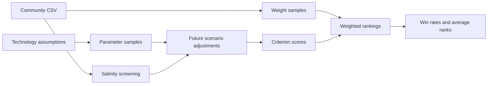

# Desalination MCDA

**Author: Dylan Patrick Dettloff.** Research prototype for comparing desalination technologies under different community conditions and future scenarios.

## Problem and approach

There is no context-free ranking that captures every deployment priority. This model combines a salinity screen with 11 criterion scores across Technical, Operations, Environmental, and Cost categories. Monte Carlo sampling varies technology parameters and decision weights.



Technologies: RO, ED, HDH, and MSPD. Contexts: Madagascar, Navajo Nation, Namibia, Rajasthan, and Chennai. Futures: Baseline, EnergyPriceSpike, RenewablesCheaper, BrineRegTightens, and TechLearning.

## Quick start

Python 3.11 or later. From this folder:

```bash
python -m venv .venv
source .venv/bin/activate
python -m pip install -r requirements.txt
python run.py --parameters 20 --weights 50 --seed 7
```

On Windows, activate with `.venv\Scripts\activate` instead. Results go to `output/results.csv` and `output/baseline.csv`. These reduced sample counts are for quick verification, not final research inference.

The source notebook uses 400 parameter samples and 1,500 weight samples. That larger run is substantially slower:

```bash
python run.py --parameters 400 --weights 1500 --seed 7
```

The tested command-line environment uses NumPy 2.3.5 and pandas 2.2.3. The notebook additionally needs Jupyter and matplotlib for its plotting cells; these optional notebook dependencies are not included in the CLI requirements.

## Example and provenance

The browser viewer reads the saved `desal_mcda_param_futures_summary.csv` from the research folder. For the Navajo baseline, the stored ED win rate is approximately 78.06%. This is a share of modeled rankings, not a probability of successful deployment. The historical CSV has not been independently regenerated at its full sample settings in this packaging pass.

- `research.ipynb`: original notebook with saved outputs and execution counts cleared.
- `model.py`: source extracted from the model-definition cells. Only the default input path was adapted to resolve relative to the module.
- `run.py`: new CLI wrapper with configurable sample counts and seed.
- `community_inputs.csv`: original illustrative community inputs.
- `source-manifest.json`: SHA-256 fingerprints of the selected original source files.
- `index.html`, `app.js`, `data.js`: new viewer of the stored results.

The original research folder is unchanged. Paper drafts, unrelated files, and private correspondence are not included. The research model predates this portfolio; the packaging and browser viewer were developed with AI assistance.

## Model limitations and open issues

1. Community ratings are illustrative assumptions, not validated field measurements or stakeholder surveys.
2. Thermal technologies receive placeholder electric-energy scores; full thermal-energy and lifecycle accounting is absent.
3. Unknown capital cost contributes zero to the simplified unit-cost calculation while receiving a neutral capital-cost score. This may favor technologies with incomplete data.
4. The `operator_capacity` documentation says a high rating means low capacity, but the weighting function inverts the scale. Resolve the intended convention before drawing new conclusions.
5. Clipping a weight vector and then normalizing it does not guarantee that every final weight remains within the intended bounds.
6. Qualitative proxies, fixed scalability scores, and coarse scoring bins can strongly influence rankings. Technology maturity is not a deployment constraint.
7. Equal scores are ordered by the sorting behavior rather than receiving shared ranks. Cross-scenario parameter draws are not paired.
8. Technology assumptions require a source-by-source literature audit. Input ranges are preserved as research assumptions, not certified engineering data.

These issues are disclosed rather than silently changing the original research method. This is a research prototype, not a final engineering recommendation. No license is granted for the original research by this packaging step.
